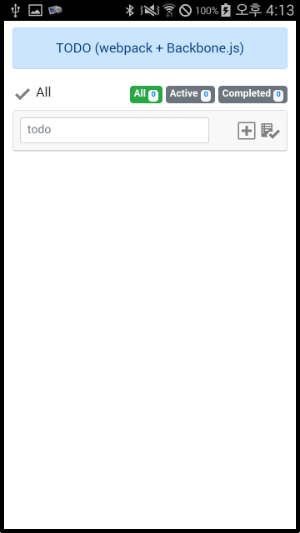
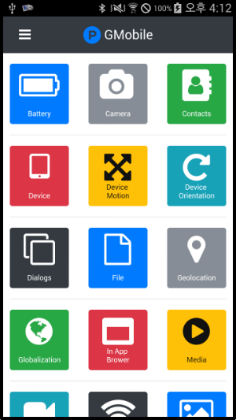

# GMobile CLI
gmobile-cli is tool to create gmobile project in terminal.

## Prerequisites
[Node.js](https://nodejs.org/ko/), [Apache Cordova](https://cordova.apache.org/)

## Installation
* `webpack + backbone.js` The temporary name is gmobile v2. I used webpack and backbone.js for web resources.
```sh
$ npm install -g https://github.com/jimmybae/gmobile-cli.git
```
* `gmobile v1` I used gmobile for web resources.
```sh
$ npm install -g https://github.com/jimmybae/gmobile-cli.git#gmobile.v1
```

## Usage
* Display help for the gmobile command.
```sh
$ gmobile -h
```
* Display help for the gmobile init command.
```sh
$ gmobile init -h
```
* Display version for the gmobile cli.
```sh
$ gmobile -v
```
* Initialize the gmobile project resource.
```sh
$ gmbile init
? Directory web is not empty. Replace the contents? (Y/n)
......
```

## Example `webpack + backbone.js`
0. Install
```sh
$ npm install -g https://github.com/jimmybae/gmobile-cli.git
```
1. Create cordova project
```sh
$ cordova create gmobile-cli-test com.gmobile.cli.app GmobileCliTest
Creating a new cordova project.
$ cd gmobile-cli-test
```
2. Delete an existing web resource
```sh
$ cd www
$ rm -r *
$ cd ..
```
3. GMobile initialization
```sh
$ gmobile init
? Directory web is not empty. Replace the contents? Yes
[info] Web resource initialization succeeded.
? Choose the costom plugins to apply.
......
```
4. Web resource build
```sh
$ cd web
$ npm install
$ npm run build
$ cd ..
```
5. Add platforms
```sh
$ cordova platforms add android
```
6. Android Studio import & run



## Example `gmobile.v1`
0. Install
```sh
$ npm install -g https://github.com/jimmybae/gmobile-cli.git#gmobile.v1
```
1. Create cordova project
```sh
$ cordova create gmobile-cli-test com.gmobile.cli.app GmobileCliTest
Creating a new cordova project.
$ cd gmobile-cli-test
```
2. Delete an existing web resource
```sh
$ cd www
$ rm -r *
$ cd ..
```
3. GMobile initialization
```sh
$ gmobile init
? Directory www is not empty. Replace the contents? Yes
[info] Web resource initialization succeeded.
? Choose the costom plugins to apply.
......
```
4. Cordova plugins add
```sh
$ cordova plugins add cordova-plugin-device
Installing "cordova-plugin-device" for android
......
$ cordova plugins add cordova-plugin-dialogs
Installing "cordova-plugin-dialogs" for android
......
```
5. Add platforms
```sh
$ cordova platforms add android
```
6. Android Studio import & run



## Issue
* webpack build 시점
  1. web -> www (now : cordova.js가 있다고 가정하고 webpack build를 해야하는데 에러가 안날까? 뭐 방법이 있긴 하겠지)
  2. platforms/android/app/src/main/assets/www (but 이렇게 하면 android, ios 두개의 소스가 관리되어야 하는 거잖어)

## License
MIT
