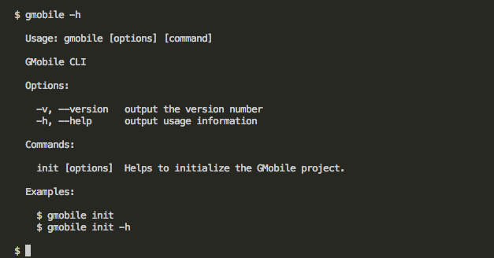

# GMobile CLI
GMobile CLI(Command line Interface)는 터미널에서 GMobile Project를 생성하는 툴이다.  
기존 이클립스에서 Glue Mobile 플러그인을 설치하지 않고도 Node.js 환경의 터미널에서 명령어를 이용하여 프로젝트를 생성해주는 도구이다. Node.js 환경을 구성하여 설치와 실행 명령어로 애플리케이션을 구성할 수 있다.
## Prerequisites
### Node.js 설치
> Node.js는 Chrome V8 JavaScript 엔진으로 빌드된 JavaScript 런타임이다.  

최신 버전의 Node.js를 다운로드하여 설치한다. [Node.js](https://nodejs.org/ko/)  
  


### Node.js 설치확인  
```sh
$ node -v
$ npm -v
```
Node.js설치가 완료되면 terminal 또는 cmd를 실행하여 다음 명령어로 버전을 확인한다.  

- `node -v` : Node.js의 버전을 표시   
- `npm -v` : NPM(Node Package Manager)의 버전을 표시  
  


### Cordova 설치
> Apache Cordova는 오픈 소스 모바일 개발 프레임 워크다.  
  
```sh
$ npm install -g cordova
```
terminal 또는 cmd에서 npm을 이용하여 Cordova를 설치한다.  
[Documentation - Apache Cordova](https://cordova.apache.org/docs/en/latest/index.html)  
  
  


### Cordova 설치확인  
```sh
$ cordova -v
```
Cordova 설치가 완료되면 terminal 또는 cmd를 실행하여 다음 명령어로 버전을 확인한다.  

- `cordova -v` : Cordova의 버전을 표시  
  


### Android Studio 설치
> Android Studio는 안드로이드를 위한 공식 통합 개발 환경 (IDE)이다.  

최신버전의 Android Studio를 다운받아 설치한다.  
[Android Studio Download](https://developer.android.com/studio/)  
  


## Installation
### GMobile CLI 설치
```sh
$ npm install -g https://github.com/jimmybae/gmobile-cli.git
```
terminal 또는 cmd에서 npm을 이용하여 GMobile CLI를 설치한다.  
[GMobile CLI](https://github.com/jimmybae/gmobile-cli)
  


### 설치확인
gmobile 도움말 명령어를 사용하여 설치여부를 확인한다.
  
```sh
$ gmobile -h
```

## Usage
### gmobile -h
```sh
$ gmobile -h
```
gmobile 명령의 도움말을 표시한다.
<br />
<br />
  
- **Options**  
  - `-v, --version` : GMobile CLI의 버전 표시  
  - `-h, --help` : 도움말 표시  
<br />
- **Commands**  
  - `init` : GMobile Project 자원 초기화  
  

### gmobile init -h
```sh
$ gmobile init -h
```
gmobile init 명령의 도움말을 표시한다.
<br />
<br />
  
- **Options**  
  - `-w, --web` : 웹 자원 초기화
  - `-m, --mobile` : 모바일 자원(플러그인) 추가
  - `-h, --help` : 도움말 표시  
  

### gmobile -v
```sh
$ gmobile -v
```
GMobile CLI의 버전을 표시한다.  

### gmobile init
```sh
$ gmobile init
```
GMobile Project 자원을 초기화 한다. 옵션 없이 실행하면 자원(웹, 모바일)을 모두 초기화 및 추가한다.

`gmobile init`을 실행하면 먼저 웹 자원을 초기화 하며, `web` 폴더를 생성 할지 묻는다.


`예(Yes)`를 선택하면 웹 자원의 초기화를 완료하고 모바일 자원에서 추가할 플러그인을 선택하는 목록이 나타난다.


선택을 완료하면 모바일 자원(플러그인)이 추가된다.

  
현재 실행 폴더가 Cordova 프로젝트가 아니면 에러가 발생한다.

### gmobile init -w
```sh
$ gmobile init -w
```
GMobile Project의 웹 자원만 초기화 한다.
### gmobile init -m
```sh
$ gmobile init -m
```
GMobile Project의 모바일 자원(플러그인)만 추가한다.

## Example
앞서 가이드를 참고하여 설치를 완료하고 사용법을 확인 했다면
Cordova + GMobile CLI + Android Studio를 이용하여 예제 애플리케이션을 만드는 방법을 소개한다.
### Cordova Project Create  
```sh
$ cordova create gmobile-app com.gmobile.app GmobileApp
$ cd gmobile-app
```
Cordova 프로젝트를 생성하고 프로젝트 폴더로 이동한다.  
  

### Delete an existing web resource `(www folder)`  
```sh
$ cd www
$ rm -r *
$ cd ..
```
기존 웹자원`(www 폴더)`의 내용을 삭제한다.  
  

### GMobile Project Initialize  
```sh
$ gmobile init
```
gmobile init명령어를 이용하여 자원(웹, 모바일)을 초기화 및 추가한다.  
  

### Web resource build  
```sh
$ cd web
$ npm install
$ npm run build
$ cd ..
```
웹자원을 webpack를 이용하여 빌드한다.(빌드된 파일은 www폴더에 위치한다.)  
  


### Platforms Add  
```sh
$ cordova platform add android
```
Cordova 프로젝트에 Android 플랫폼을 추가한다.  
  


### `Option` Cordova Prepare or Build  
```sh
$ cordova prepare android
$ cordova build android
```
자원이 변경되는 경우 지정하는 플랫폼의 관련된 소스 파일을 업데이트 한다.  
  

### Android Studio Import
Cordova 프로젝트의 Android 플랫폼 폴더를 Android Studio에서 import하여 애플리케이션을 실행시킨다.  
  
1. Android Studio를 실행하고 Import project (Gradle, Eclipse ADT, etc.)을 선택한다.  


2. 앞서 생성한 Cordova 프로젝트의 Android 플랫폼 폴더를 선택하고 Open을 클릭한다.  


3. Android Studio가 초기화 작업을 진행한다.  


4. 프로젝트 Import가 완료되면 애플리케이션 Run버튼을 클릭한다.  


5. PC에 연결한 Android Device를 선택하고 OK버튼을 클릭한다.  


6. Android Device에서 애플리케이션을 확인한다.  


# GMobile CLI - gmobile.v1
GMobile CLI의 gmobile.v1은 웹자원에서 glue.js를 사용하는 초기버전이다.
GMobile CLI와 다른 부분인 Installation, Example만 기술한다.
## Prerequisites
GMobile CLI의 Prerequisites항목을 참고한다.

## Installation
### GMobile CLI 설치
```sh
$ npm install -g https://github.com/jimmybae/gmobile-cli.git#gmobile.v1
```
terminal 또는 cmd에서 npm을 이용하여 GMobile CLI를 설치한다.  
[GMobile CLI: branch gmobile.v1](https://github.com/jimmybae/gmobile-cli/tree/gmobile.v1)
  


### 설치확인
gmobile 도움말 명령어를 사용하여 설치여부를 확인한다.
  
```sh
$ gmobile -h
```

## Usage
GMobile CLI의 Usage항목을 참고한다.

## Example
앞서 가이드를 참고하여 설치를 완료하고 사용법을 확인 했다면
Cordova + GMobile CLI + Android Studio를 이용하여 예제 애플리케이션을 만드는 방법을 소개한다.
### Cordova Project Create  
```sh
$ cordova create gmobile-app com.gmobile.app GmobileApp
$ cd gmobile-app
```
Cordova 프로젝트를 생성하고 프로젝트 폴더로 이동한다.  
  

### GMobile Project Initialize  
```sh
$ gmobile init
```
gmobile init명령어를 이용하여 자원(웹, 모바일)을 초기화 및 추가한다.  
  

### Plugins Add  
```sh
$ cordova plugin add cordova-plugin-device
$ cordova plugin add cordova-plugin-dialogs
```
웹 자원에서 기본적으로 사용하는 플러그인(device, dialogs)을 설치한다.  
  

### Platforms Add  
```sh
$ cordova platform add android
```
Cordova 프로젝트에 Android 플랫폼을 추가한다.  
  

### `Option` Cordova Prepare or Build  
```sh
$ cordova prepare android
$ cordova build android
```
자원이 변경되는 경우 지정하는 플랫폼의 관련된 소스 파일을 업데이트 한다.  
  

### Android Studio Import
Cordova 프로젝트의 Android 플랫폼 폴더를 Android Studio에서 import하여 애플리케이션을 실행시킨다.  
  
1. Android Studio를 실행하고 Import project (Gradle, Eclipse ADT, etc.)을 선택한다.  


2. 앞서 생성한 Cordova 프로젝트의 Android 플랫폼 폴더를 선택하고 Open을 클릭한다.  


3. Android Studio가 초기화 작업을 진행한다.  


4. 프로젝트 Import가 완료되면 애플리케이션 Run버튼을 클릭한다.  


5. PC에 연결한 Android Device를 선택하고 OK버튼을 클릭한다.  


6. Android Device에서 애플리케이션을 확인한다.  
